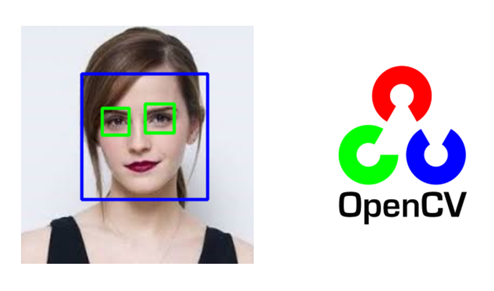

# Face and Eyes Detection using Haar Cascades in OpenCV-Python

<table>
  <tr>
    <td> </td>
  </tr>
</table>

## 1. Objective

The objective of his task is to demonstrate the application of trained Haar Cascades face and eyes detector in OpenCV-Python.

## 2. Haar Cascades Face Detector

Face Detection, a widely popular subject with a huge range of applications. Modern day Smartphones and Laptops come with in-built face detection software, which can authenticate the identity of the user. There are numerous apps that can capture, detect and process a face in real time, can identify the age and the gender of the user, and also can apply some really cool filters. The list is not limited to these mobile apps, as Face Detection also has a wide range of applications in Surveillance, Security and Biometrics as well

Viola and Jones proposed popularly,  Haar Cascades face detector, the first ever object detection framework for real time face detection in video footage. Additional information about the Haar Cascades face detector can be found on the references section.

OpenCV comes with a pre-trained Haar Cascades for detecting human faces and eyes. In this project, we shall deploy these detectors to detect human faces and eyes from various types types of test images as well as live video stream. 

## 3. Data

We shall deploy the  Haar Cascades face detector  to detect human faces and eyes from various types types of test images as well as live video stream. 

## 4. Sample Face and Eyes Detection Results

In this section, we illustrate sample face and eyes detection results from still imagery and live video frames.

### 4.1 Detection from Images

<table>
  <tr>
    <td> </td>
  </tr>
</table>

### 4.2 Detection from Live Video Stream

<table>
  <tr>
    <td> </td>
  </tr>
</table>

## 5. Analysis

In view of the presented results, we make the following observations:

* In spite of its speeds and ability to detect clearly visible faces, the Haar Cascades face and eyes detectors are not without limitations:
* Some of the erroneous detections are puzzling and difficult to explain:
* Too many false-positives for some of the images.
* Some of the missed detections for clearly visible faces are just puzzling
* The eye detector appear much worse than the face detector, especially when using live camera streaming video.
* The face detector appear very sensitive to:
* The face pose: It is not able to detect most of the turned faces
* The face scale: It is not able to detect most of the far and small faces
* Skin tone: It is able to able to detect some of the faces with darker skin tones.
* Obstruction: It is not able to detect some of the partially obscured faces.

## 6. Future Work

We plan to investigate some of the related issues:

* Get a better understanding of the details involved in implementing the Haar Cascades detectors
* Test these detector with more diverse data and identity their limitations
* Search for and explore other pre-trained Haarr Cascades face and eyes detectors

## 7. References

1. Paul Viola, Michael Jones. (April 15, 2021). Rapid Object Detection using a Boosted Cascade of Simple Features. https://www.cs.cmu.edu/~efros/courses/LBMV07/Papers/viola-cvpr-01.pdf 
2. OpenCV. (April 15, 2021). Face Detection using Haar Cascades. https://opencv-python-tutroals.readthedocs.io/en/latest/py_tutorials/py_objdetect/py_face_detection/py_face_detection.html 
3. Girija Shankar Behera. (April 15, 2021). Face Detection with Haar Cascade. https://towardsdatascience.com/face-detection-with-haar-cascade-727f68dafd08 
4. Adarsh Menon. (April 15, 2021). Face Detection in 2 Minutes using OpenCV & Python. https://towardsdatascience.com/face-detection-in-2-minutes-using-opencv-python-90f89d7c0f81 
5. Parul Pandey. (April 15, 2021). Face Detection with Python using OpenCV. https://www.datacamp.com/community/tutorials/face-detection-python-opencv 6. Stack Abuse. 6. (April 15, 2021). Facial Detection in Python with OpenCV. https://stackabuse.com/facial-detection-in-python-with-opencv/ 
7. Hussain Mujtaba. (April 15, 2021). Face Recognition with Python and OpenCV. https://www.mygreatlearning.com/blog/face-recognition/ 
8. GeekforGeeks. (April 15, 2021). OpenCV C++ Program for Face Detection. https://www.geeksforgeeks.org/opencv-c-program-face-detection/ 
9. Valeriia Koriukina. (April 15, 2021). Using Facial Landmarks for Overlaying Faces with Masks. https://learnopencv.com/tag/face-detection/ 
10. Vikas Gupta. (April 15, 2021). Face Detection - OpenCV, Dlib and Deep Learning ( C++ / Python ). https://learnopencv.com/face-detection-opencv-dlib-and-deep-learning-c-python/ 
11. Min Sun. (April 15, 2021). OpenCV - Face Detection. https://www.cs.princeton.edu/courses/archive/fall08/cos429/CourseMaterials/Precept1/facedetect.pdf 
12. BeWagner. (April 15, 2021). Building a face detector with OpenCV in C++. https://bewagner.net/programming/2020/04/12/building-a-face-detector-with-opencv-in-cpp/
