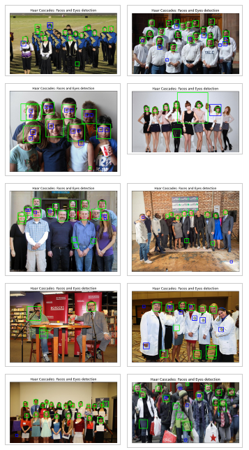

# Face and Eyes Detection using Haar Cascades in OpenCV-Python

<table>
  <tr>
    <td> </td>
  </tr>
</table>

# 1. Objective

The objective of his task is to demonstrate the application of trained Haar Cascades face and eyes detector in OpenCV-Python.

2. Haar Cascades Face Detector

Face Detection, a widely popular subject with a huge range of applications. Modern day Smartphones and Laptops come with in-built face detection software, which can authenticate the identity of the user. There are numerous apps that can capture, detect and process a face in real time, can identify the age and the gender of the user, and also can apply some really cool filters. The list is not limited to these mobile apps, as Face Detection also has a wide range of applications in Surveillance, Security and Biometrics as well

Viola and Jones proposed popularly,  Haar Cascades face detector, the first ever object detection framework for real time face detection in video footage. Additional information about the Haar Cascades face detector can be found on the references section.

OpenCV comes with a pre-trained Haar Cascades for detecting human faces and eyes. In this project, we shall deploy these detectors to detect human faces and eyes from various types types of test images as well as live video stream. 

3. Data

We shall deploy the  Haar Cascades face detector  to detect human faces and eyes from various types types of test images as well as live video stream. 

## 4. Sample Face and Eyes Detection Results

In this section, we illustrate sample face and eyes detection results from still imagery and live video frames.

### 4.1 Detection from Images

<table>
  <tr>
    <td> </td>
  </tr>
</table>

# Video-Face-Detection-Recognition--OpenCV-Cpp

## 1 Objective

To demonstrate detecting and recognizing human faces and eyes from live video digital camera stream using OpenCV C++ API Haar Cascades built-in functionalities. 

## 2 Code

|#                 | File name         |  Description 
|------------------|-------------------|--------------------|
|1                 | /code/face_detection_recognition_opencv.cpp      |OpenCV C++ API implementation of the functionalties for detecting and recognizing human faces and eyes from live video digital camera stream using OpenCV C++ API Haar Cascades.  |
|2                | /code/face_detection_recognition_opencv.ipynb      |OpenCV C++ Python implementation of the functionalties for detecting and recognizing human faces and eyes from live video digital camera stream using OpenCV Python API Haar Cascades.  |

## 3 Face Detection and Tracking 

In this section, we will demonstrate the use of Haar cascade face detector implmented in OpenCV to detect and track faces from live stream video stream, Thhe results are illustrated in the figure below.

<table>
   <tr>
    <td> Captured Frame</td>
    <td> Face Detection results  ></td>
  </tr>
  <tr>
    <td> 10</td>
    <td> </td>
  </tr>
  <tr>
    <td> 100</td>
    <td> </td>
  </tr>
</table>

## 4 Face Recognition

## 5 Conclusion

